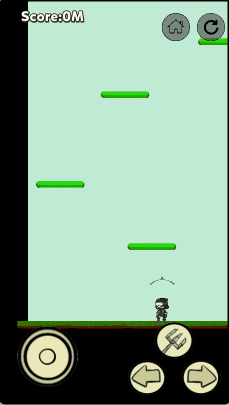
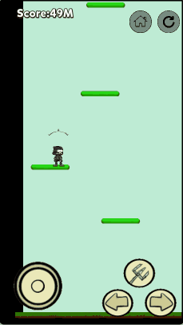

# The Hook Man

Embark on a thrilling vertical adventure in this Doodle Jump-inspired game! Control a nimble ninja as you climb to dizzying heights using a <i>Grappling Hook</i>. Test your reflexes, defy gravity, and see how high you can ascend!

### Install or Play Online

- Play Online: [instein.itch.io/thehookman](instein.itch.io/thehookman)

- Install on Android: [TheHookMan.apk](https://github.com/Instein98/TheHookMan/releases/download/V1.0.0/TheHookMan.apk)

### Instructions

- ##### On Smartphone:

  :  Drag to control hook direction

  :  Launch/retract hook

   :  Horizontal movement

- ##### On PC:

  **Mouse**: Drag  to control hook direction
  
  **Space**: Launch/retract hook
  
  **A/D**: Move horizontally

### Tips

1. **Master Circular Motion**: Find the perfect swing to reach higher platforms

   

2. **Platform Locking**: Stuck? Try securing your position on the current platform

   
